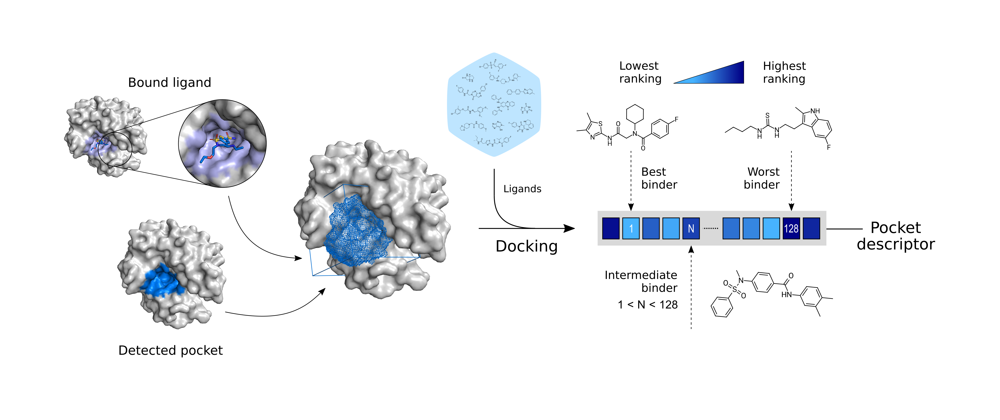

# PocketVec

Pocket descriptors characterize protein binding sites in the shape of numerical vectors, which enable the high-throughput exploration of the pocket space.

**PocketVec** is a novel strategy to generate protein binding site descriptors based on the assumption that similar pockets bind similar ligands. The approach is built upon inverse virtual screening (docking): the prioritization of a predefined set of small molecules is expected to be more correlated between a pair of similar pockets than between a pair of dissimilar ones. In short, each pocket is represented by the set of numerical ranks provided by small molecules in docking calculations. Further conceptual and methodological details are best described in the original PocketVec publication: REF. 

The **PocketVec Repository** holds the code needed to create a PocketVec descriptor for any protein binding site of interest together with all results presented along the manuscript. The directory structure is specified as follows:

* `code`: funcions, scripts and notebooks to generate PocketVec descriptors. 
* `data`: sets of small molecules to dock. (?)
* `examples`: example exercises. Check section `Basic usage` for further details. 
* `results`: PocketVec paper results.

# Installation

1. Clone this repository to your local PocketVec folder:
        
        cd ~ && mkdir -p pocketvec && cd pocketvec
        git clone https://gitlabsbnb.irbbarcelona.org/acomajuncosa/pocketvec.git

2. Create a conda environment with all the requirements:

        conda env create --name pocketvec_env --file=environment.yml
        conda activate pocketvec_env

# Running PocketVec

Once the 'pocketvec_env' conda environment has been activated (previous section), running PocketVec is as simple as:

        python pocketvec_main.py --receptor <PATH_TO_RECEPTOR> --pocket_centroid <PATH_TO_POCKET_CENTROID> --output <PATH_TO_OUTPUT>

* `<PATH_TO_RECEPTOR>`: Path to protein receptor. Should be in MOL2 format and ready for docking. E.g. `./run_pocketvec/1A42_prepared.mol2`
* `<PATH_TO_POCKET_CENTROID>`: Path to pocket centroid. We typically represent it as a single C atom with 3D cordinates in a SD file. E.g. `./run_pocketvec/CTR_LIG.sd`
* `<PATH_TO_OUTPUT>`: Output path. All files generated along the PocketVec descriptor calculation will be left here. E.g. `./run_pocketvec`

Optional parameters such as the number of docking runs or the radius of the defined cavity can be additionally specified. To check all options:

        python pocketvec_main.py --help

# Speed

PocketVec is built upon inverse virtual screening, which means that its computational cost is mainly due to docking calculations.

# Basic usage

# External dependencies

PocketVec exercises rely 

# Citation

[REF]